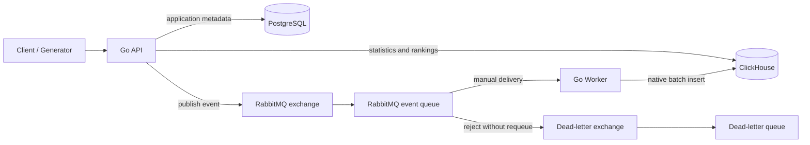

# App Analytics Platform

[](https://github.com/DenisKorendiasev/app-analytics-platform/actions/workflows/ci.yml)

Data-intensive backend platform for collecting and analyzing mobile application events. Built with Go, PostgreSQL, RabbitMQ, ClickHouse, and Docker Compose.

## Project overview

The platform accepts application metadata and high-volume event traffic through an HTTP API, processes events asynchronously, and serves analytical statistics and rankings from ClickHouse.

The repository is intentionally a focused backend MVP rather than a collection of infrastructure demos. It includes:

- application creation and lookup;
- event ingestion with application validation;
- asynchronous RabbitMQ delivery with publisher confirms and manual acknowledgements;
- batched ClickHouse writes with bounded retry and dead-letter handling;
- per-application statistics and install rankings;
- synthetic data generation and a reproducible ClickHouse benchmark;
- unit, race, integration, and end-to-end tests in GitHub Actions.

## Architecture



The API and Worker are separate binaries built from one repository. PostgreSQL owns transactional application metadata, RabbitMQ separates request handling from analytical writes, and ClickHouse stores the append-oriented event stream and executes aggregate queries.

## Tech stack

| Area | Technology | Role |
| --- | --- | --- |
| Language | Go 1.25+ | API, Worker, generator, benchmark |
| Transactional storage | PostgreSQL 17 | Application metadata and existence checks |
| Messaging | RabbitMQ 4 | Durable event queue, publisher confirms, acknowledgements, DLQ |
| Analytical storage | ClickHouse 26.3 | Batched event storage, statistics, rankings |
| Containers | Docker, Docker Compose | Reproducible local stack and health-aware startup |
| Testing | Go testing, race detector, Testcontainers | Unit, integration, and end-to-end coverage |
| CI | GitHub Actions, golangci-lint | Four required pull-request checks |

The implementation uses the standard `net/http` router and `log/slog`, `pgx` for PostgreSQL, the native ClickHouse Go client, and the maintained AMQP 0.9.1 Go client.

## How it works

1. A client creates an application. The API validates and stores it in PostgreSQL.
2. Before accepting an event, the API validates its fields and verifies that its `app_id` exists.
3. The API generates an `event_id`, publishes a persistent JSON message, and waits for a RabbitMQ publisher confirmation before returning `202 Accepted`.
4. The Worker consumes with manual acknowledgements and a prefetch of 500.
5. Events are written to ClickHouse in native batches. Deliveries are acknowledged only after ClickHouse reports success.
6. Statistics and rankings are queried directly from ClickHouse through the API.

The API and Worker both use structured JSON logs and graceful shutdown. Startup fails fast when a required PostgreSQL, RabbitMQ, or ClickHouse connection cannot be established.

## Event flow

```text
POST /api/v1/events
        │
        ├─ validate payload and app_id in PostgreSQL
        ├─ assign event_id
        └─ publish persistent message + wait for broker confirm
                                │
                                ▼
                    RabbitMQ app.events queue
                                │
                      batches of 500 or 1 s
                                │
                                ▼
                      ClickHouse events table
                                │
                     ack RabbitMQ deliveries
```

Malformed or structurally invalid messages are rejected without requeue and sent to `app.events.dead-letter`. A failed ClickHouse batch is attempted at most three times with 100 ms and 200 ms delays; an exhausted batch is dead-lettered and the Worker returns an error.

The consumer side is **at least once**, not exactly once. RabbitMQ can redeliver an unacknowledged event, and a ClickHouse insert can succeed while its response or subsequent acknowledgement is lost. `event_id` removes duplicates only when they occur in the same Worker batch; it remains the reconciliation key for duplicates across batches or process restarts. See [Event processing reliability](docs/reliability.md) for the complete model.

## Why PostgreSQL

Applications are transactional reference data: identifiers must be unique, required fields must be constrained, and the API needs an inexpensive existence check before accepting an event. PostgreSQL provides those guarantees and keeps this workload independent from analytical event scans.

## Why ClickHouse

Events are append-oriented and are primarily read through counts, conditional sums, time ranges, and ranking aggregations. The `MergeTree` table partitions by event month and sorts by `(app_id, timestamp, event_id)`, which matches per-application time-range analytics while keeping repeated dimensions in `LowCardinality(String)` columns.

## Why RabbitMQ

RabbitMQ decouples HTTP latency from ClickHouse batch writes and supplies durable queues, backpressure through prefetch, explicit acknowledgements, and dead-letter routing. Publisher confirms prevent the API from reporting a successful publish before RabbitMQ accepts responsibility for it.

The application declares its local-development topology so new environments are self-contained. Production environments would usually manage changeable dead-letter settings through RabbitMQ policies.

## Batch processing

The Worker flushes when either condition is met:

- 500 deliveries have accumulated; or
- one second has elapsed since the first delivery entered an empty batch.

Repeated `event_id` values within the batch produce one ClickHouse row while all matching RabbitMQ deliveries are acknowledged. On shutdown, the Worker stops accepting deliveries, drains its in-flight buffer, flushes the final batch, and then closes its resources.

The measured benchmark showed that native batching dominates single-row insertion on the recorded local setup. Batch size 500 delivered roughly 7,842 events/s versus 15.9 events/s for individual inserts. These are isolated measurements, not an end-to-end SLA; methodology and raw results are in [Performance measurements](docs/performance.md).

## How to run

### Requirements

- Git
- Docker with Docker Compose
- Go 1.25+ only when running commands outside containers

### Quick start

```bash
git clone https://github.com/DenisKorendiasev/app-analytics-platform.git
cd app-analytics-platform
docker compose up -d
docker compose ps
curl http://localhost:8080/health
```

Compose builds missing application images automatically. Add `--build` after local source changes when an existing image must be rebuilt.

Expected health response:

```json
{"status":"ok"}
```

Fresh volumes initialize the PostgreSQL and ClickHouse schemas automatically. The default endpoints are:

| Service | Address |
| --- | --- |
| API | `http://localhost:8080` |
| RabbitMQ Management | `http://localhost:15672` |
| PostgreSQL | `localhost:5432` |
| ClickHouse HTTP | `http://localhost:8123` |
| ClickHouse native | `localhost:9000` |

Local credentials are intentionally development-only and are documented in [.env.example](.env.example). Copy it to `.env` to override ports or credentials. The applications also accept the same values directly from environment variables.

Stop the stack while retaining its named volumes:

```bash
docker compose down
```

To run the Go binaries directly, start `postgres`, `rabbitmq`, and `clickhouse` with Compose, then run `go run ./cmd/api` and `go run ./cmd/worker` in separate terminals.

### Upgrade note for older RabbitMQ volumes

RabbitMQ does not allow a durable queue to be redeclared with different arguments. Environments created before dead-letter support was added must drain and delete the old `app.events` queue, then restart the API or Worker. Fresh clones need no manual action.

## API examples

Create an application:

```bash
curl -i --json '{
  "name": "Spotify",
  "publisher": "Spotify AB",
  "category": "music"
}' http://localhost:8080/api/v1/apps
```

Copy the returned `id`, then retrieve the application:

```bash
curl http://localhost:8080/api/v1/apps/<app-id>
```

Publish an event. Supported event types are `install`, `session`, and `purchase`; platforms are `android` and `ios`.

```bash
curl -i --json '{
  "app_id": "<app-id>",
  "event_type": "purchase",
  "country": "RS",
  "platform": "android",
  "revenue_cents": 999,
  "timestamp": "2026-08-19T12:35:02Z"
}' http://localhost:8080/api/v1/events
```

The Worker flushes a partial batch after one second. Query statistics with optional inclusive UTC dates, country, and platform:

```bash
curl 'http://localhost:8080/api/v1/apps/<app-id>/stats?from=2026-08-01&to=2026-08-19&country=RS&platform=android'
```

```json
{
  "app_id": "b8edbe8d-4fa6-42fd-a351-9a98d17d8b83",
  "installs": 0,
  "sessions": 0,
  "purchases": 1,
  "revenue_cents": 999
}
```

Query install rankings. `limit` defaults to 10 and is bounded to 1–100.

```bash
curl 'http://localhost:8080/api/v1/rankings?metric=installs&country=RS&from=2026-08-01&to=2026-08-19&limit=10'
```

Rankings are ordered by install count descending and application ID ascending for deterministic ties. `installs` is currently the only supported ranking metric.

## Testing

Run the fast local checks:

```bash
go fmt ./...
go vet ./...
go test ./...
go test -race ./...
go build ./...
```

Run the complete Testcontainers suite with a local Docker daemon:

```bash
go test -tags=integration ./test/integration -v -count=1
```

The integration suite starts PostgreSQL, RabbitMQ, and ClickHouse, then isolates every test with a PostgreSQL schema, ClickHouse database, and RabbitMQ topology. It covers repositories, migrations, message format and persistence, DLQ routing, redelivery, analytical queries, performance tooling, and an end-to-end HTTP → RabbitMQ → Worker → ClickHouse scenario.

GitHub Actions runs four independent checks on every pull request and push to `main`:

| Check | Verification |
| --- | --- |
| Format, vet, and build | `gofmt`, `go vet`, `go build` |
| golangci-lint | pinned `v2.12.2` configuration |
| Unit and race tests | `go test`, `go test -race` |
| Integration tests | complete tagged Testcontainers suite |

## Performance

Generate traffic through the public API:

```bash
go run ./cmd/generator --api-url=http://localhost:8080 --apps=100 --events=100000
```

Measure isolated ClickHouse insertion using temporary databases that are removed after the run:

```bash
go run ./cmd/performance --events=1000 --runs=3 --batches=1,100,500,1000
```

Recorded medians on the documented Apple M4 / Docker Desktop environment:

| Batch size | Insert operations | Events/s |
| ---: | ---: | ---: |
| 1 | 1000 | 15.90 |
| 100 | 10 | 1,663.14 |
| 500 | 2 | 7,841.99 |
| 1000 | 1 | 15,147.05 |

The harness also loads 100,000 deterministic events and records the real statistics query plan. See [docs/performance.md](docs/performance.md) before comparing or quoting the results.

## Architecture decisions

| Decision | Rationale | Trade-off |
| --- | --- | --- |
| Separate API and Worker binaries | Keeps request handling independent from asynchronous storage | Two processes must be operated |
| PostgreSQL for apps, ClickHouse for events | Matches transactional and analytical access patterns | Cross-store operations are not atomic |
| RabbitMQ between API and Worker | Enables batching, backpressure, and failure isolation | Delivery is at least once and needs reconciliation |
| Manual acknowledgements after insert | Avoids acknowledging events before storage | Lost acknowledgements can cause duplicates |
| Bounded in-process retry plus DLQ | Avoids hot requeue loops and preserves failed payloads | DLQ inspection/replay is operational work |
| Batch-local `event_id` deduplication | Removes common duplicate deliveries without extra storage | Does not deduplicate across batches or restarts |
| Application-declared RabbitMQ topology | Makes fresh and test environments self-contained | Existing queue argument changes require migration |
| One repository with internal packages | Keeps the MVP easy to build, test, and review | Independent deployment boundaries remain limited |

## Future improvements

The current repository is a complete portfolio MVP, with several production-oriented extensions intentionally left out:

- Prometheus metrics, dashboards, and alerting;
- durable cross-batch idempotency with explicitly defined replay semantics;
- operator-managed RabbitMQ policies and highly available queue configuration;
- authentication, authorization, TLS termination, and secrets management;
- additional ranking metrics and richer analytical dimensions;
- retention policies, capacity testing, and horizontal deployment guidance;
- distributed tracing and correlation fields across API, broker, and Worker.

These are future design choices rather than implied capabilities of the current system.
